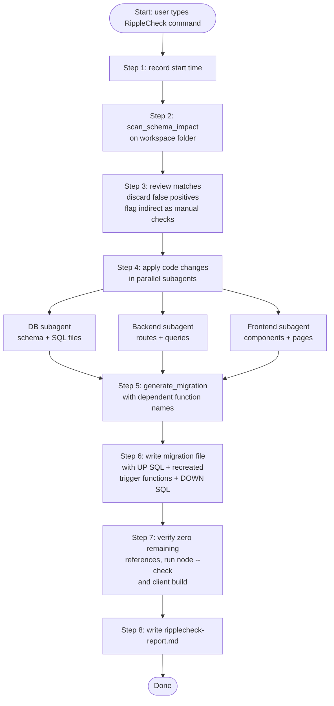

# RippleCheck

Safe PostgreSQL column renames and drops across database, backend, and frontend, run inside IBM Bob.

---

## The Problem

Renaming a column in PostgreSQL is a one-line `ALTER TABLE`, but the work doesn't stop there:

- Every SQL query, route handler, API response key, and UI component that reads that column by name
  will break at runtime.
- There is no compiler error — the references are strings and property accesses scattered across
  the whole stack.
- **PostgreSQL does not update PL/pgSQL function bodies when you run `RENAME COLUMN`.** Trigger
  functions that reference the old column name continue to compile, but fail silently at runtime.
  The only fix is to drop and recreate them in the same migration.

The traditional approach is to grep the codebase by hand, hope nothing is missed, and write the
migration from memory. RippleCheck automates the whole thing.

---

## How It Works

An MCP server provides two **deterministic, non-AI** tools. A Bob custom mode wraps them in an
8-step workflow that runs automatically when you type a single command.

### The two tools

| Tool | What it does |
|---|---|
| `scan_schema_impact` | Walks a project directory, finds every file that references a field by name (direct), and flags files structurally coupled via `SELECT *`, spreads, or type aliases (indirect). |
| `generate_migration` | Produces `UP` and `DOWN` SQL for a rename or drop, and warns about every PL/pgSQL function that must be recreated. |

Both tools are plain TypeScript — no LLM calls, no network requests, deterministic output.

### The 8-step workflow

When you type `RippleCheck: rename table.column to newName` (or `drop`), the RippleCheck mode
runs these steps in order:



Code changes for database, backend, and frontend layers run in **parallel subagents**, so all
three layers are edited simultaneously. Each subagent only touches lines the scan flagged.

---

## Demo

Renamed `sightings.upvote_count` to `vote_count` in
[spookie-web-v2](https://github.com/lcpratik/spookie-web-v2/tree/ripplecheck-demo), a real
React / Express / PostgreSQL app.

Full report: [`examples/ripplecheck-report.md`](examples/ripplecheck-report.md)
Migration file: [`examples/202609261216_rename_sightings_upvote_count.sql`](examples/202609261216_rename_sightings_upvote_count.sql)

### Results

| | |
|---|---|
| Files changed | 5 across 3 layers |
| Lines changed | 11 (3 in DB, 4 in backend, 4 in frontend) |
| False positives | 0 |
| Trigger functions recreated | 1 (`update_sighting_upvote_count`) |
| Client build | passing (built in 1.22s) |
| Total time | 1 minute 51 seconds |

### Remaining `upvoteCount` hits after the rename — and why they are correct

The final grep found 4 occurrences of `upvoteCount` in `UpvoteButton.jsx` and its callers.
These are the **React component's own prop name** — a UI contract that is intentionally
independent of the database column name. The callers already pass the new value correctly:
`upvoteCount={sighting.vote_count}`. RippleCheck left them unchanged, which is the right
behaviour.

### Layer breakdown

**Database** — `server/db/schema.sql`
- L14: column definition
- L47: trigger INSERT branch
- L50: trigger DELETE branch

**Backend** — `server/routes/sightings.js`
- L12: `SORTS.corroborated` ORDER BY key
- L45: SELECT column list
- L207: upvote refresh SELECT
- L211: JSON response key

**Frontend**
- `client/src/components/SightingCard.jsx` L38
- `client/src/pages/Read.jsx` L56
- `client/src/pages/SightingDetail.jsx` L84, L86

---

## Install

### 1. Build the MCP server

```bash
cd mcp-server
npm install
npm run build
```

### 2. Register the MCP server in Bob

Add to `~/.bob/settings/mcp.json` (create the file if it doesn't exist):

```json
{
  "mcpServers": {
    "ripplecheck": {
      "command": "node",
      "args": ["/absolute/path/to/ripplecheck/mcp-server/dist/server.js"]
    }
  }
}
```

Replace the path with the actual absolute path on your machine. Bob hot-reloads on save.

### 3. Install the custom mode

If `~/.bob/settings/custom_modes.yaml` does not exist, copy it directly:

```bash
cp docs/ripplecheck-mode.yaml ~/.bob/settings/custom_modes.yaml
```

If the file already exists and contains other modes, append the `ripplecheck` entry from
`docs/ripplecheck-mode.yaml` to the existing `customModes` array — do not overwrite the file.

---

## Usage

1. Open a project in Bob and switch to **RippleCheck** mode (mode picker, bottom-left).
2. Type one of:
   ```
   RippleCheck: rename table.column to newName
   RippleCheck: drop table.column
   ```
3. RippleCheck scans the project, applies all changes in parallel, generates the migration, verifies
   zero remaining references, and writes `ripplecheck-report.md` in the project root.

---

## IBM Bob Features Used

| Feature | How RippleCheck uses it |
|---|---|
| **MCP tools** | `scan_schema_impact` and `generate_migration` are registered as MCP tools; Bob calls them automatically based on their descriptions. |
| **Custom mode** | The `ripplecheck` mode sets the persona, restricts tool permissions to `read`, `edit`, `execute`, `mcp`, `todo`, and `subagent`, and embeds the 8-step `customInstructions` workflow. |
| **Parallel subagents** | Step 4 spawns three independent subagents (DB, backend, frontend) that run simultaneously, each editing only their layer. |
| **Agent mode** | The underlying Agent mode provides file editing, shell execution, and MCP tool access that the custom mode builds on. |

Session screenshots are in [`bob_sessions/`](bob_sessions/).

---

## Limitations and Future Work

**Current limitations**

- Scans JS, TS, JSX, TSX, SQL, GraphQL, and Prisma files only. Other languages are not supported.
- Targets PostgreSQL only. MySQL, SQLite, and other databases are not covered.
- Supports `rename` and `drop` only. Type changes are not supported.
- Migrations are not wrapped in a transaction (`BEGIN` / `COMMIT`). A partial failure leaves the
  database in an inconsistent state.
- Not yet tested against a live database — only schema files and application code have been
  validated.

**Possible future work**

- Wrap generated migrations in `BEGIN` / `COMMIT`.
- Add support for column type changes (`ALTER COLUMN … TYPE`).
- Extend scanning to Python, Ruby, and Go codebases.
- Add a dry-run mode that shows the diff without writing any files.
- Test the generated SQL against a real PostgreSQL instance as part of the workflow.
